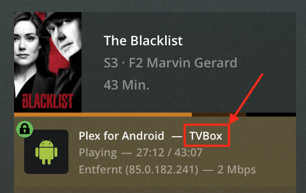

# Plex Plugin for Homebridge

Use the active sessions on your Plex server as a sensor in Homebridge. Enable your cozy cinema light scene when Plex starts playing and go back to your normal lighting when playback stops.

## Installation

You install the plugin the same way you installed Homebridge - as a global NPM module:

```bash
sudo npm install -g homebridge-plex
```

If you don't have a Homebridge installation yet, head over to the [project documetation](https://github.com/nfarina/homebridge) for more information.

## Configuration

The plugin uses the following config values:

Variable | Description
-------- | -----------
`accessory` | Must be `Plex`
`name` | Whatever you want the accessory to be named in Homekit
`plex_token` | The X-Plex-Token used to access your Plex server API. See [Finding an authentication token / X-Plex-Token](https://support.plex.tv/hc/en-us/articles/204059436-Finding-an-authentication-token-X-Plex-Token)
`host` | The hostname / IP address of your Plex server. Defaults to `localhost`, can be omitted if Homebridge runs on the same server as your Plex.
`port` | The port of your Plex server. Defaults to `32400`
`filter` | An array of filter rules. See [filtering sessions](#filtering-sessions)

Typical config example:
```json
{
  "accessories": [
    {
      "accessory": "Plex",
      "name": "Plex",
      "plex_token": "​...",
      "filter": [
        {
            "user": "your-plex-username",
            "player": "your-favorite-player"
        }
      ]
    }
  ]
}
```

## Filtering Sessions

Plex will show up in your [Home app](https://www.apple.com/ios/home/) as an "Occupancy Sensor". You can use this sensor in any automation you like.

Let's assume you have a home cinema with an Apple TV and the Plex app installed. You want to switch to your cinema light scene when you start watching a movie, so that all the lights dim down.
Now you probably also have a smartphone or a tablet from which you occasionally stream a movie. To avoid these devices or even other users triggering the light scene in your home cinema, you can configure your sensor ignore everything other than the Apple TV.

You can configure an array of objects (we'll call that object a "filter rule"), each containing either a `user` or a `player` key or both. If any of the filter rules match an active session on your Plex server, the sensor in your Homekit will trigger and keep being triggered until you pause or stop the playback. So you can attach a scene to the "occupancy detected" event as well as the "occupancy stopped being detected" event.

If you define a filter rule only containing a `user` value, any device of that user will trigger the sensor. If you only define a `player` (e.g. my-apple-tv), then any player with that name will trigger the sensor, regardless of the user (This makes sense if multiple users use the same Apple TV).

### Finding your user and player name

Just start a movie on the device you want to trigger the sensor and head over to the [Plex web app](https://app.plex.tv/desktop). Navigate to Status -> Now Playing.



The `player` is in the upper left corner (in this example it's "your-player") and the `name` is next to your profile picture in the bottom right (here "your-user").
